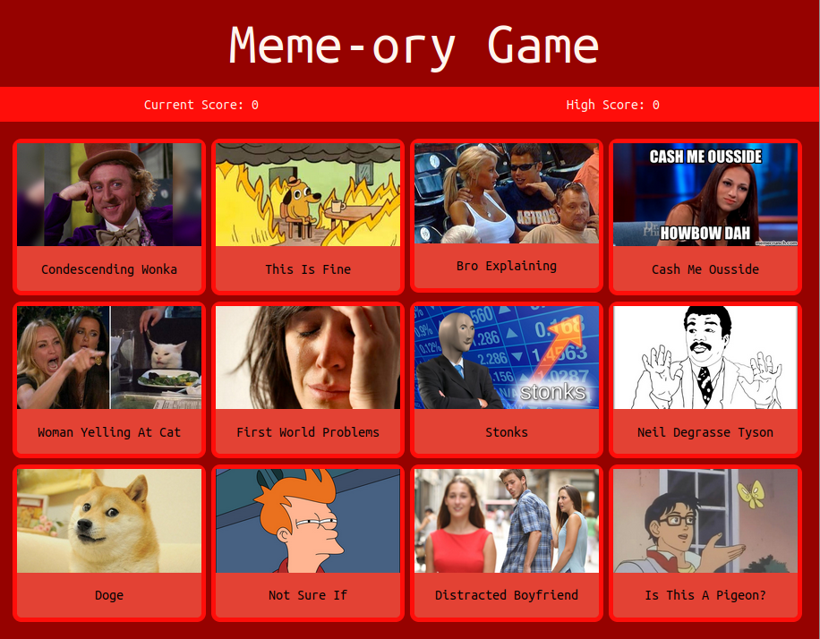

Meme-ory Game [LIVE](https://abstractdev.github.io/Meme-ory-Game/)

============

A memory game created with React to practice functional components and hooks.

---

## How To Play
- Click as many cards as you can without repeating.
- Score is logged for each round
- Max score is 12
## Built With
- React
- Vanilla CSS
## Concepts
- React Functional Components
- React Conditional Rendering
- React UseState
- React UseEffect
- React UseRef

---
